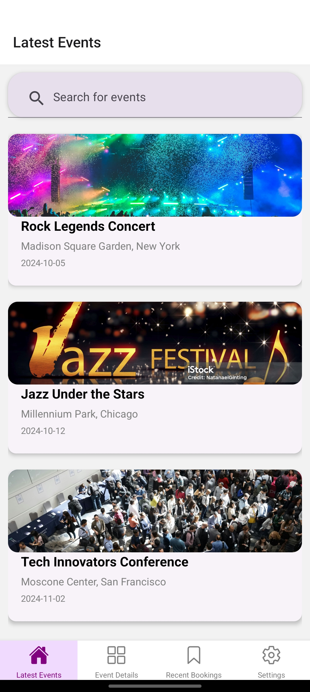
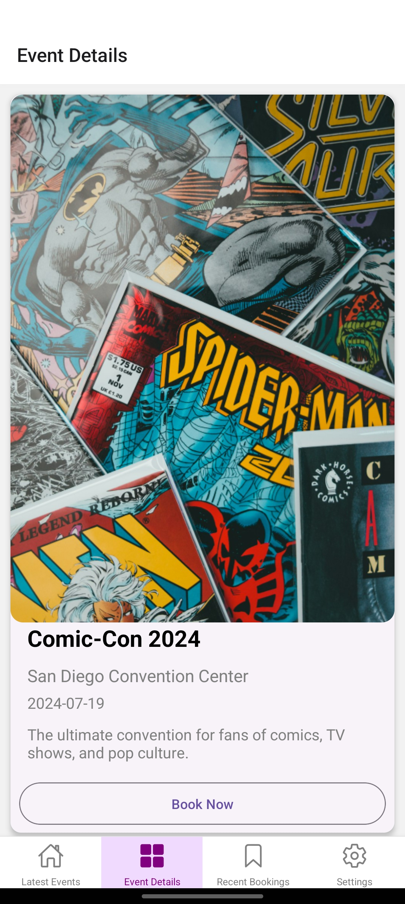

# Event Booking App

This is a mobile application built using **React Native** and **Expo** that allows users to browse, search, and book events. The app interacts with a mock API to simulate real-world functionality, making it an excellent tool for understanding event booking systems.

## Features

- **User-Friendly Interface**: A clean and intuitive UI that allows users to navigate through upcoming events effortlessly.
- **Event Listings**: View a list of available events with essential details such as title, date, location, and images.
- **Search Functionality**: Easily find events by searching with keywords.
- **Event Details**: Click on any event to see detailed information and a "Book Now" button.
- **Mock API Integration**: The app uses a mock API to fetch event data, allowing for realistic interaction without the need for a backend setup.

## Demo

Here are some screenshots of the app in action:

| Home Screen                                      | Event Details                                      | Booking Screen                                      |
| ------------------------------------------------ | ------------------------------------------------- | --------------------------------------------------- |
|          |        |        |

## Download the APK

You can download the APK for this app from the following link:

- [Download APK](https://expo.dev/accounts/the_judgernautt_10/projects/assignment-event-app/builds/e5cd37e5-a442-4d6e-82e2-7d840316ca71)  


## Tech Stack

**Client:** ReactNative, 

**Server:** Async Storage


## Additional Features

- Signup Screen
- Settings Screen
- Recent Bookings Screen


## API Reference

#### Get all items
link to mock api:

```http
  GET https://dev-tu4ac2vhvnontna.api.raw-labs.com/mock/json-api
```

| Parameter | Type     | Description                |
| :-------- | :------- | :------------------------- |
| `api_key` | `string` | . No API key Required|


## Run locally on your Expo CLI

Clone the project

```bash
  git clone https://github.com/Sama2911arth/Event-Booking-App-made-using-React-Native-and-a-mock-api.git
```

Go to the project directory

```bash
  cd Event-Booking-App-made-using-React-Native-and-a-mock-api
  cd assignment-event-app
```

Install dependencies

```bash
  npm install
```

Start the server

```bash
  npm start
```


## Screenshots


## Deployment

To deploy this project run

```bash
  npm run deploy
```


## Documentation

[Documentation](https://docs.expo.dev/)

